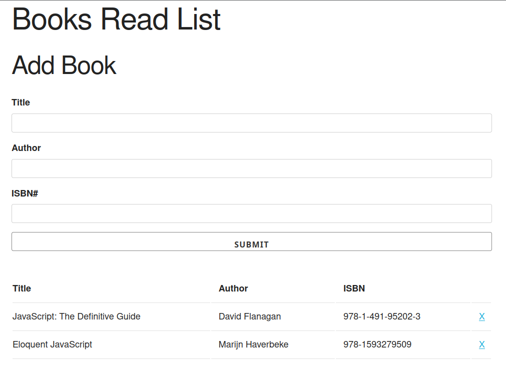

# Book list
A toy app that keeps track of a book list. The purpose was to get some practice with OOP.

It uses no JS frameworks, just vanilla JavaScript.

Click [here](https://lifebalance.github.io/book-list/) to see it **live**!

## Dependencies:

* [Skeleton 2.0.4](http://getskeleton.com/)
